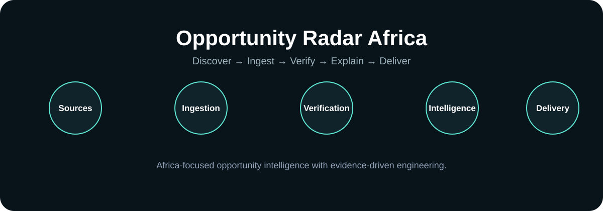

# Opportunity Radar Africa

**AI-powered discovery of opportunities across Africa.**

> **Repository status:** Active development. This README separates implemented repository capabilities from roadmap and environment-dependent work.

## Documentation standard

This repository follows the premium documentation standard established for NSMS: strong product positioning, visual orientation, architecture, security boundaries, setup, validation evidence, maturity tracking, roadmap separation, and honest production-status language.

| Evidence label | Meaning |
|---|---|
| **IMPLEMENTED** | Present in the repository. |
| **TESTED** | Supported by an executed test or CI result. |
| **DEPLOYED** | A deployment target/configuration exists. |
| **VERIFIED IN PRODUCTION** | Confirmed with production evidence. |
| **MEASURED** | Backed by an actual measurement. |
| **ROADMAP** | Planned work, not a shipped capability. |

The existing project-specific technical documentation below remains the source for detailed implementation information.

---

**Engineered with OAE™ — Open Autonomous Engineer**

> Professionalization is evidence-driven: OAE™ changes are verified before they are accepted.
